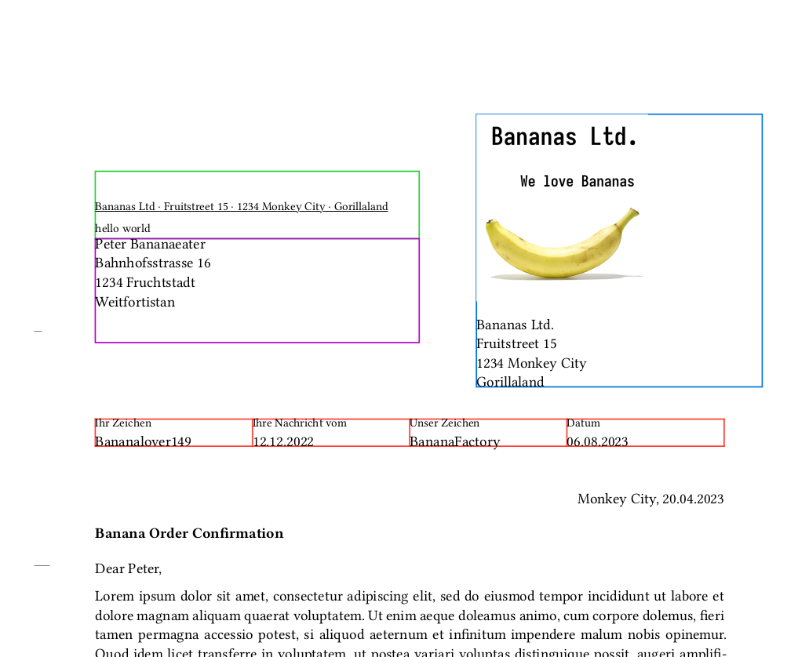

# typst l<sub>e</sub>tt<sub>e</sub>r

A customizable Typst letter template with some presets for DIN 5008 A/B and
Swiss C5 Letter.

Please note that the template is still under development and subject to breaking
changes. 



# Letter Structure

A letter should have the following form.

```
#import "../template.typ": *
#show: lttr_init.with(
    format: "DIN-5008-B",
    title: "Writing Letters in Typst is Easy",
    opening: "Dear Sir, Madam or Mother,",
    ...
)

#show: lttr_preamble

Your letter content.

#show: lttr_closing
```

# Templates

- `lttr_init` is responsible to compute all values from the parameters and
  default values for different formats. It also sets the `page` and `text`
  attributes.

- `lttr_preamble` renders `lttr_sender`, `lttr_receiver`,
  `lttr_indicator_lines`, `lttr_content_offset`, `lttr_attrs`,
  `lttr_date_place`, `lttr_title` and `lttr_opening`. You can also call them
   seperately.

- `lttr_closing` renders the closing line and the signature.

# Prameters

All Parameters are optional and will override the global defaults and the
defaults of the chosen format. 

## Basics (Overview)

- `debug` [Bool] (default=false)   
  Whether or not to show (colorful) debug lines.

- `format` [String] (default="custom")   
  Format of the letter ("DIN-5008-A", "DIN-5008-B", "C5-WINDOW-RIGHT").

- `_page` [Dict] (default=(:))   
  Set page settings ([docs](https://typst.app/docs/reference/layout/page/)).

- `_text` [Dict, none] (default=(:))   
  Set text settings ([docs](https://typst.app/docs/reference/text/text/)).

- `settings` [Dict, none]   
  Basic settings.
  - `min_content_spacing` [Length]  
    Minimum space between top margin and beginning of the letter content.
  - `content_spacing` [Length]  
    Minimum spacing between sender/receiver and letter content.
  - `justify_content` [Bool]  
    Wheter or not to justify the content.

  Example:

  ```typst
  settings: (
    min_content_spacing: 100mm,
    content_spacing: 8.46mm,
    justify_content: true,
  ),
  ```

- `indicator_lines` [Dict, none]   
  Info to render lines for the hole puncher and folding ([see below](#indicator-lines)).
  - `show_puncher_mark` [Bool]  
     Wheter or not to show the puncher mark.
  - `fold_marks` [Array]  
     Lenghts from top of page of the fold marks

  Example:

  ```typst
  indicator_lines: (
    show_puncher_mark: true,
    fold_marks: (87mm, 87mm+105mm),
  )
  ```

## Sender and Receiver (Overview)

- `receiver` [Dict, Array, Content]   
   Info to render the receiver fields.
  - `position` [Dict]  
    Position of the address field (`top: [Length]`, `left: [Length]`) 
  - `dimensions` [Dict]  
    Dimensions of the address field (`width: [Length]`, `height: [Length]`)
  - `content` [Array, Content, String]  
    Content of the receiver field.

  Example:

  ```typst
  receiver: (
    "Peter Doe",
    "Somestreet 16",
    "1234 New York",
  ),
  ```

- `return_to` [Dict, Array, Content]   
   The returning address.
  - `position` [Dict]  
    Position of the return_to field (`top: [Length]`, `left: [Length]`) 
  - `dimensions` [Dict]  
    Dimensions of the return_to field (`width: [Length]`, `height: [Length]`)
  - `content` [Array, Content, String]  
    Content of the return_to field.

  Example:

  ```typst
  return_to: "Some Address, I don't care...",
  ```

- `remark_zone` [Dict, Array, String, Content]   
   The remark zone ([see below](#remark_zone)).
  - `position` [Dict]  
    Position of the remark_zone field (`top: [Length]`, `left: [Length]`) 
  - `dimensions` [Dict]  
    Dimensions of the remark_zone field (`width: [Length]`, `height: [Length]`)
  - `align` [Align]  
    Alignment of the remark_zone.
  - `content` [Array, Content, String]  
    Content of the remark_zone field.

  ```typst
  remark_zone: (
    "This is a",
    "multiline remark",
  )
  ```

- `sender` [Dict, Array, none]   
   Info to render the sender fields ([see below](#sender)).
  - `content` [Array, Content] (default: none)  
    Content or array of lines for the sender field. 
  - `position` [Dict] (default: none)  
    Position of the sender field.
  - `width` [Length]  
    Width of the sender field.

  Example:

  ```typst
  sender: (
    content: (
      "John Doe",
      "Somestreet 15",
      "1234 New York",
    )
    position: (left: 110mm, top: 20mm),
    width: 80mm,
  ),
  ```

## Letter Beginning (Overview)

- `opening` [Dict, String, none]   
  Info to render the `title` template ([see below](#opening)).
  - `spacing` [Length]  
   Spacing before the letter opening.
  - `content` [Content]  
    Content of the opening (e.g. "Dear Sir....").

  Example:

  ```typst
  opening: (
    spacing: 2mm,
    content: "Dear Sir or Madam,",
  )
  ```

- `date_place` [Dict, String, none]   
  Info to render the `date_place` template ([see below](#date-place)).
  - `date` [Content]  
    Date of the letter.
  - `place` [Content]  
    Place of the letter.
  - `align` [Align]  
    Alignment of the place and date

  Example:

  ```typst
  date_place: (
    date: "20.04.2023",
    place: "Weitfortistan",
    align: left,
  ),
  ``` 

- `title` [Dict, String, none]   
  Info to render the `title` template ([see below](#title)). Also set as document property.
  - `spacing` [Length]  
    Spacing before the title.
  - `content` [String]  
    Content of the title.

  Example:

  ```typst
  title: (
    spacing: 2mm,
    content: "Writing Letters in Typst is Easy",
  )
  ```

## Letter Ending (Overview)

- `author` [String, Array, none]   
  Author(s) of the letter in the document properties. If not specified, `signature` is used.

- `closing` [Dict, String, none]   
  Info to render the closing ([see below](#closing)).
  - `spacing` [Length]  
    Spacing before the closing.
  - `content` [Content]  
    Content of the closing (e.g. "kind regards").

  Example:

  ```typst
  closing: (
    spacing: 2mm,
    content: "kind regards",
  )
  ```

- `signature` [Dict, none]   
  Info to render the signature ([see below](#signature)).
  - `spacing` [Length]  
    Spacing before the signature.
  - `content` [Content]  
    Content of the signature

  Example:

  ```typst
  signature: (
    spacing: 2mm,
    content: "Peter Pan",
  )
  ```

# Other functions

- `lttr_state` prints the entire state used to render the components.

# Resources

- [DIN 5008 Form A](https://de.wikipedia.org/wiki/DIN_5008#/media/Datei:DIN_5008,_Form_A.svg)
- [DIN 5008 Form B](https://de.wikipedia.org/wiki/DIN_5008#/media/Datei:DIN_5008_Form_B.svg)
- [Swiss
  Addressing](https://www.post.ch/-/media/portal-opp/pm/dokumente/briefe-spezifikation-gestaltung.pdf?sc_lang=de&hash=BB181E74C5D3A0D1D49A954793EA670A)

# Similar Projects

- [dvdvgt/typst-letter](https://github.com/dvdvgt/typst-letter): A typst
  template for a DIN 5008 inspired letter with the goal to fit nicely into C6/5
  envelops.
- [qjcq/awesome-typst](https://github.com/qjcg/awesome-typst): Awesome Typst
  Links 

# Test setup

TODO: make test setup better

  mkdir -p ${XDG_DATA_HOME}/typst/preview
  ln -s path/to/this/repo ${XDG_DATA_HOME}/typst/preview/lttr-0.1.0

# TODO

There are a couple of limitations in typst which I hope will be addressed.

- [ ] there is currently no way to query properties set with `set`. This would
  be nice to query the document title and author names
  [issue](https://github.com/typst/typst/issues/763). Forthermore, it is not
  possible to call `set` after the first lttr function has been called (even if
  no content was rendered added). 
- [ ] datetime with locales settings
